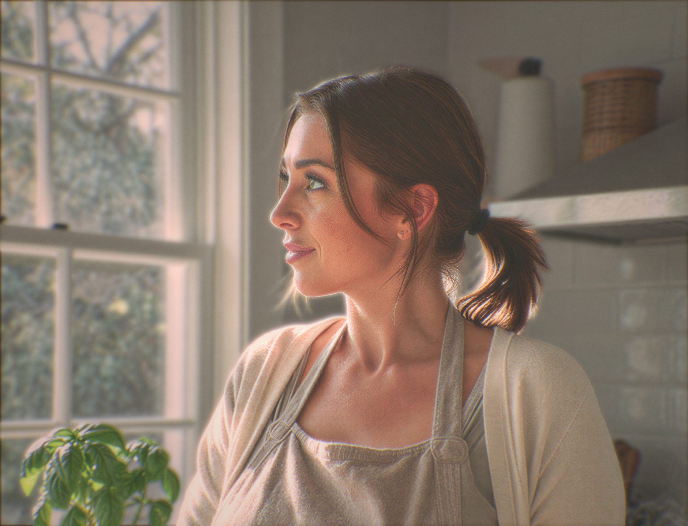
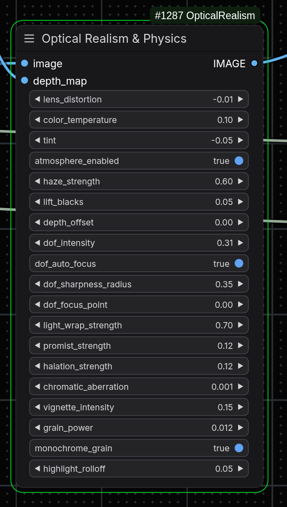
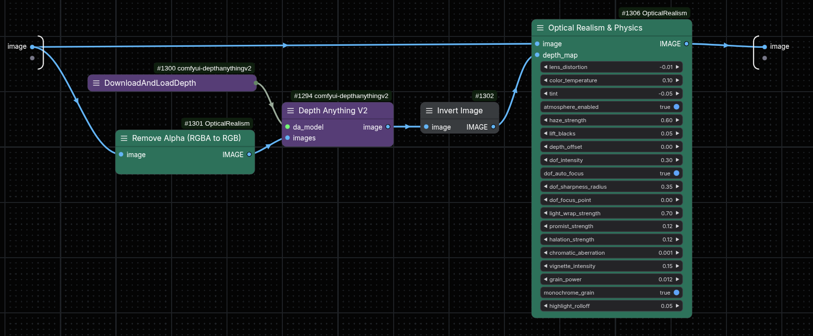
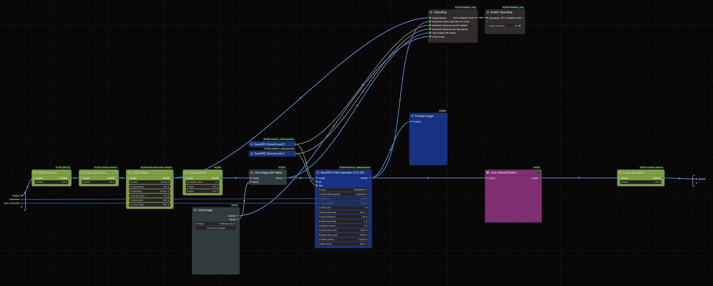
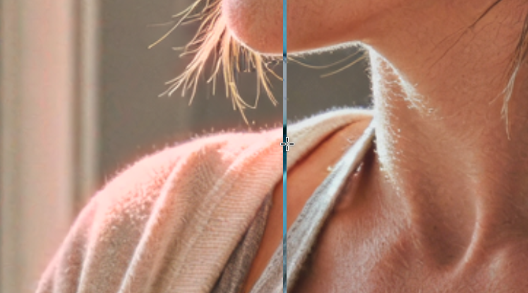
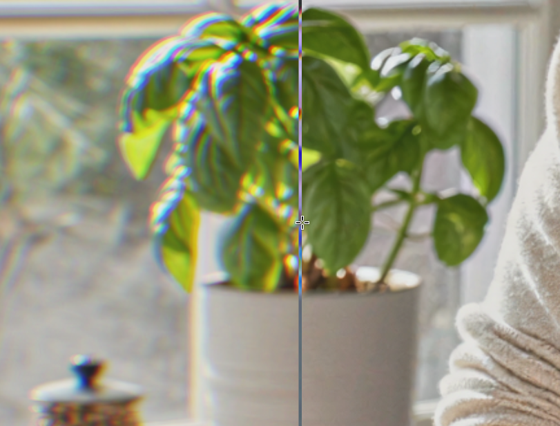
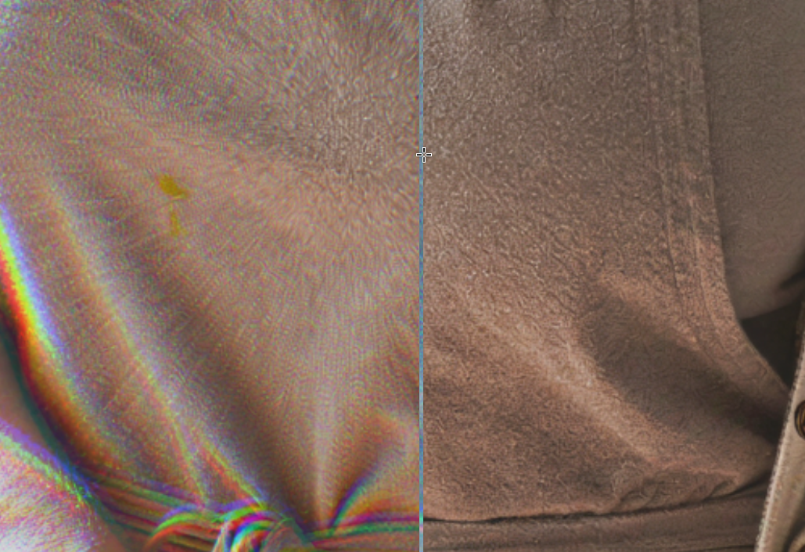
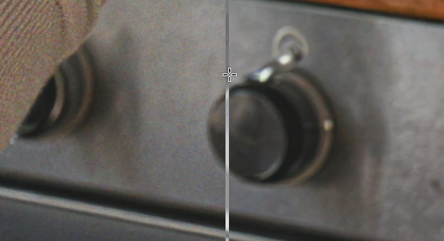
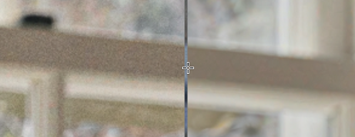
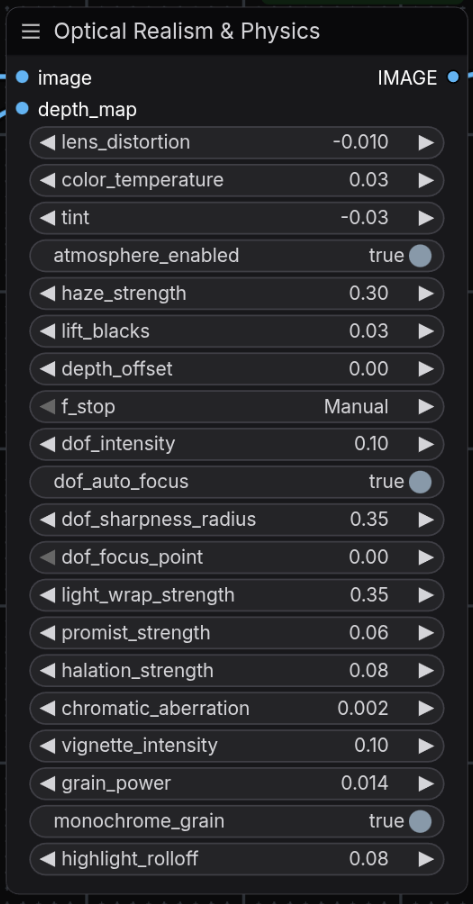

*Update 6 March 2026 New functions added. If updating, suggested to reload for sensible values.*

*Update 28 April 2026 No code changes - Added Suggested Defaults at the bottom. **Discovery:** Works REALLY great with [ComfyUI Depth Pro](https://github.com/spacepxl/ComfyUI-Depth-Pro)*

# ComfyUI-Optical-Realism

**A post-processing node to bring AI generations closer to physical photography.**

This custom node for [ComfyUI](https://github.com/comfyanonymous/ComfyUI) takes a standard RGB image and a **Depth Map**, acting as a virtual camera to apply physics-based post-processing like lens geometry, depth-of-field, light scattering, and film emulsion.

---

## The Problem vs. The Solution

| The "Typical AI Image" | Real-World Photography |
| :--- | :--- |
| Perfectly sharp everywhere | **Depth of Field (Bokeh)** isolates the subject |
| Hard edges on backlit subjects | Bright light bleeds around edges (**Light Wrap** & **Halation**) |
| Uniform black shadows | Distant shadows are lifted and hazy (**Atmospherics**) |
| Mathematically straight lines | Glass lenses slightly curve light (**Lens Distortion**) |
| Perfect white light | Real film leans warm/cool (**Temp/Tint**) |
| Digital noise floating uniformly over the image | Film grain reacts to light exposure (peaks in mid-tones, fades in highlights/shadows) |

This node addresses these optical and chemical phenomena in a single pass. 

---

## 📷 Before & After

*(Left: Raw AI Generation | Right: Optical Realism Processing)* 
| Before | After |
| :---: | :---: |
|  |  |
|  |  |

---

# Example Workflow


---

## ⚙️ Installation & Workflow

1. Clone this repository into your `custom_nodes` folder:
   ```bash
   cd ComfyUI/custom_nodes
   git clone https://github.com/skatardude10/ComfyUI-Optical-Realism.git
   ```
2. Restart ComfyUI.

---

### The Workflow 
**Crucial:** This node requires a **Depth Map** to calculate 3D space. Depth Anything V2 (specifically the `vit_l` model) is highly recommended for accurate edge detection. The example workflow includes other custom nodes you can choose to use or replace as you see fit.

**Basic Routing:**
1. **Input Image** → `Remove Alpha (included utility)` → `Optical Realism` (Image Input)
2. **Input Image** → `Depth Anything V2` → `Optical Realism` (Depth Input)

*(Note: The script assumes Black = Near, White = Far. If your depth model outputs the opposite, use an Invert Image node in between).*

| Defaults should be sensible for well-lit scenes: | Core Nodes to function (or provide your own depth map and just use the main node): |
| :---: | :---: |
|  |  |

Optional upscalers like **SeedVR2** pair incredibly well with this pipeline to clean up details before optical processing (this is included in the Example Workflow image above with a blank white mask for the upscaling input).

| Upscaling | Mask |
| :---: | :---: |
|  |  |

---

## 🎛️ The Settings Explained

Here is a breakdown of what each parameter does under the hood. *(Note: Some example images use exaggerated values for clarity).*

### 📐 Camera & Lens Geometry
* **Lens Distortion:** Mimics physical lens curvature. Positive values (`0.05`) add barrel distortion (wide-angle bulge), while negative values add pincushioning. The script safely reflects the edges to prevent black borders.
  * 
* **Color Temperature & Tint:** Shifts the white balance while mathematically preserving overall luminance so highlights don't blow out. 
  * *Tip: For a classic cinematic "Kodak" look that flatters skin tones, try `Temp: 0.10` and `Tint: -0.05`.*

### 💨 Atmospherics
* **Atmosphere Enabled:** The master switch for depth-based haze and lift.
* **Haze Strength:** How "thick" is the air? High values push the background into a humid fog.
* **Lift Blacks:** Real shadows in the distance aren't pure black (`#000000`); they are dark atmospheric grey-blue. This lifts background shadows to physically separate the subject from the environment without ruining foreground contrast.
* **Depth Offset:** Pushes the "fog curtain" forward or backward.

### 🔍 Depth of Field (Bokeh)
* **F-Stop:** (TESTING) Emulates real-world lens apertures. **Selecting an f-stop automatically overrides the manual `DoF Intensity` and `DoF Sharpness Radius` sliders.** 
  * Lower f-stops (e.g., `f/1.4`) create heavy background blur and a razor-thin focus area.
  * Higher f-stops (e.g., `f/11`) apply very mild blur and keep a wide depth of the scene perfectly in focus.
  * Leave on `Manual` to use the sliders below.
* **DoF Intensity:** Controls the size of the blur manually. *Note: This uses a custom Circular Disc Convolution, meaning out-of-focus background points will turn into realistic optical circles (Bokeh) rather than muddy Gaussian smudges.*
* **DoF Auto Focus:** When enabled, the node analyzes the center 60% of the depth map and automatically locks focus onto your main subject based on depth percentiles.
* **DoF Sharpness Radius:** The "safe zone" or deadzone around the focal point. Higher values (`0.35`) keep more of the subject crisp before the blur gently ramps up.

### 🌟 Optical Phenomena
* **Light Wrap Strength:** Takes bright background light and physically bleeds it over the edges of the foreground subject. Kills the "cutout sticker" look on backlit subjects.
* **Pro-Mist Strength:** Simulates a physical glass diffusion filter (like a Tiffen Black Pro-Mist). It isolates high-luminance pixels and creates a gentle, warm bloom, taking the "digital edge" off sharp lines.
  * | Without Pro-Mist | With Pro-Mist |
    | :---: | :---: |
    |  |  |
* **Halation Strength:** Simulates the red/orange glow of bright light bouncing off the back of physical film strips. 
  * 
* **Chromatic Aberration:** Uses sub-pixel sampling to create smooth color fringing on the edges of the frame. Keep low (`0.001 - 0.003`) for subtle realism.
  * 
  * 
* **Vignette Intensity:** Darkens the corners to mimic a physical lens barrel, subtly guiding the eye to the center.

### 🎞️ Film Emulation
* **Grain Power:** Adds analog texture. **This uses a physical photographic emulsion curve.** Instead of floating uniformly over the image, the grain mathematically reacts to exposure. It peaks heavily in the mid-tones and fades out (via transparency) in pure whites and deep blacks. The noise is also "clumped" using a micro-blur to simulate organic silver halide crystals rather than a sharp digital TV-static grid.
  * 
* **Monochrome Grain:** `True` acts like classic Film Stock (luminance noise). `False` acts like a Digital Sensor (RGB color noise).
  * 
* **Highlight Roll-off:** Prevents AI's tendency to instantly clip bright lights to harsh white. Adds a logarithmic "shoulder" to highlights, compressing them so they look creamy and smooth.

---

## 🛠️ Troubleshooting

**"RuntimeError: The size of tensor a (4) must match..."**
* Your image has an Alpha channel (RGBA) and PyTorch is expecting 3 RGB channels.
* **Fix:** I've included a helper node called **`Remove Alpha (RGBA to RGB)`**. Slot this right before the Optical Realism node.

## 🤓 Suggested Default Values

* I did not want to hard code these into the script as new suggested defaults, but along with discovering that Apple Depth Pro works great with this node, some minor tweaking left me with these values that I personnaly really enjoy.

 
